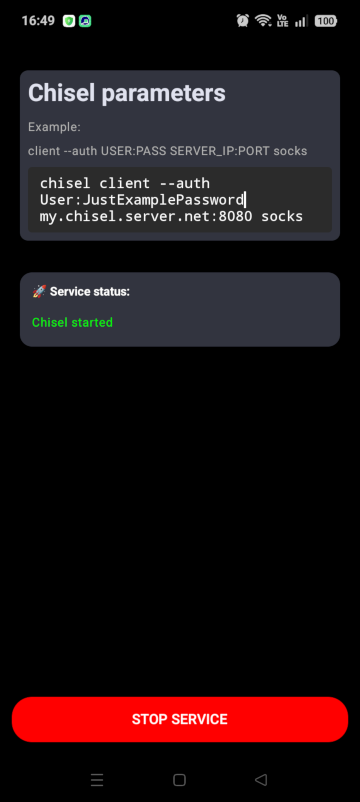

# droidchiselploy 

> Simple app for running chisel in background on Android device

A simple Android app for running chisel (a fast TCP/UDP tunnel over HTTP app written by Jaime Pillora) as a service.

The app is a fork of Droidploy by Yashvant Yadav. Its repository - https://github.com/YadavYashvant/Droidploy

Chisel repository - https://github.com/jpillora/chisel/

## Usage

When installing the APK, your Android device may display a warning that the developer is unknown (as the app is signed with a self-issued certificate) and may also detect it as unsafe because the APK file contains the chisel executable, which many antivirus programs detect as a hacktool, riskware, etc.

After launching the app, you need to specify the chisel launch parameters as described at https://github.com/jpillora/chisel/blob/master/README.md#usage, after which you can start and stop the server.

For optimal app functioning, it may be advisable to disable its unloading in idle state, disable battery optimization for the app and enable notifications (this will reduce the likelihood of the service being unloaded due to low memory).

## Compilation: 

In short: Run Android Studio, import repository, wait for import complete, run buildinging...

libdroidchiselploy.so is prebuilt chisel executable current version (1.11.5), compiled on Android device in Termux. It may be also run standalone in Termux or adb shell. 

Included apk is suitable only for ARM64/aarch64 architecture (most modern Android devices). If you need to use the application on other architectures - x86, x64 or armv7 (older 32-bit Android devices), you need to rebuild the installation package in Android Studio, having first downloaded the libdroidchiselploy.so executable file built for the target Android architecture to the \app\src\main\jniLibs\architecture_name directory.

## Disclaimer

I am not an Android developer at all, so this is no more than a proof of concept app with no guarantees of anything. I have no plans for further active developing or supporting it.
